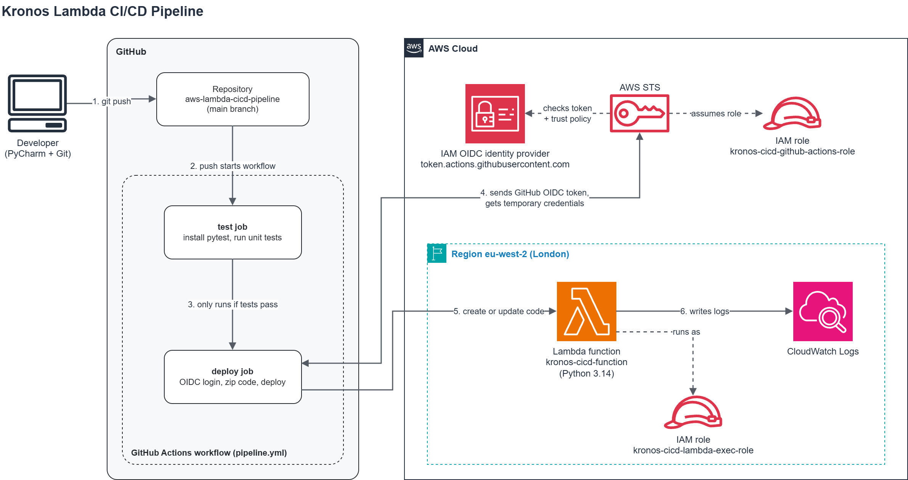
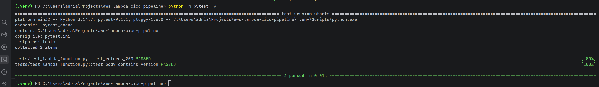
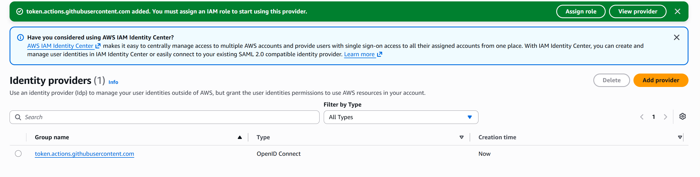
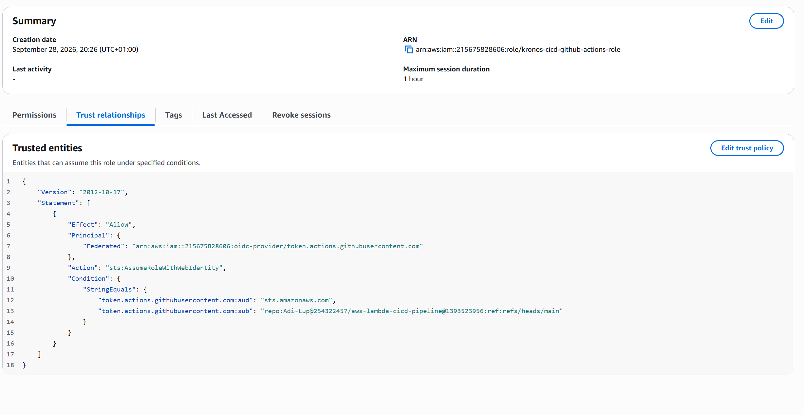
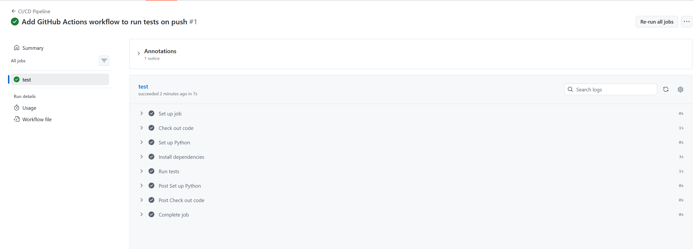
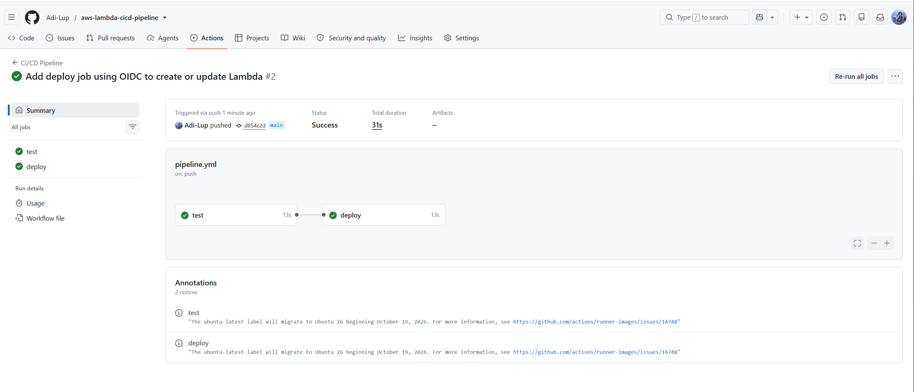
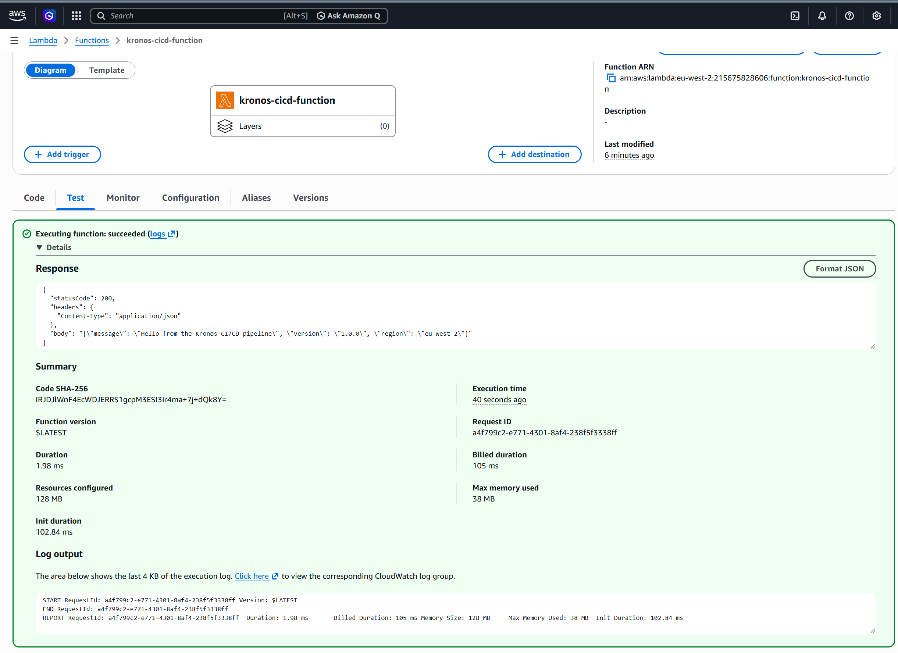
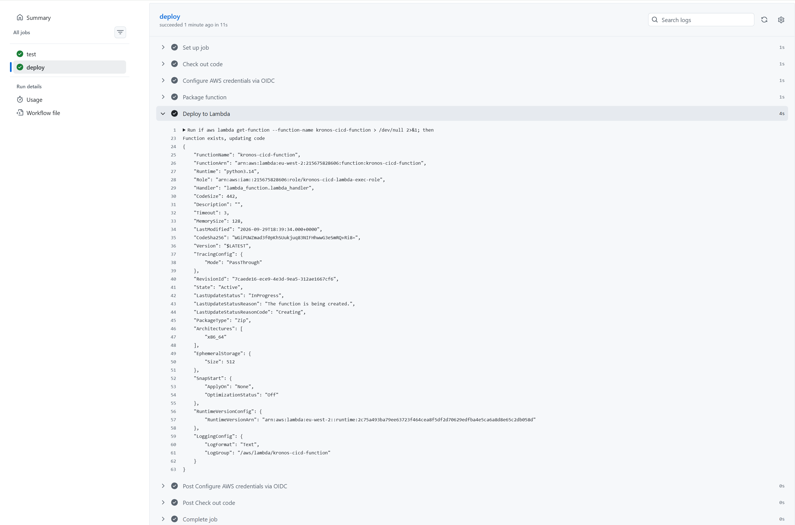
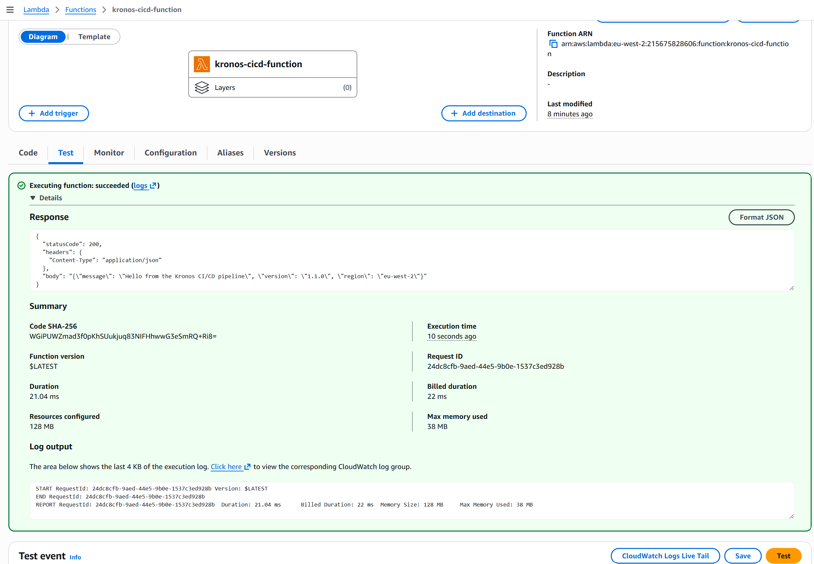
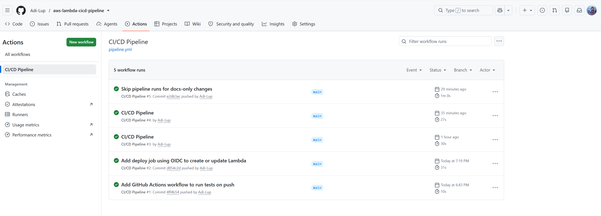

# Kronos Lambda CI/CD Pipeline

This is project 3 in my series of AWS projects. I am a second year Computer Science student and this was my first time building a CI/CD pipeline, using GitHub Actions or setting up OIDC, so I learnt a lot of it as I went.

I wanted to stop deploying things by clicking around the console, so I built a pipeline that tests my Lambda function and deploys it to AWS automatically every time I push to GitHub.

The part I cared about most was security. The pipeline logs in to AWS with OIDC, so there are no access keys saved anywhere, not in GitHub and not on my laptop.

## How it works

1. I push code to the main branch.
2. GitHub Actions starts a fresh Linux machine and runs my unit tests.
3. If the tests fail, it stops there and nothing gets deployed.
4. If they pass, GitHub asks AWS for temporary credentials using OIDC.
5. The pipeline zips the function and sends it to Lambda. The first time it creates the function, after that it just updates the code.

## Services used

| Service | What it does here |
|---|---|
| GitHub Actions | Runs the tests and the deploy on every push |
| IAM identity provider | Tells AWS to trust login tokens from GitHub |
| IAM role for the pipeline | What the pipeline is allowed to do in my account |
| IAM role for Lambda | What the function itself is allowed to do (only write logs) |
| AWS STS | Gives out the temporary credentials, which expire after an hour at most |
| Lambda (Python 3.14) | The function being deployed |
| CloudWatch Logs | Where the function logs go |

I picked GitHub Actions over AWS CodePipeline because my code is already on GitHub, it is free for public repos, and it comes up in a lot of the job adverts I have been reading.

## Why I did things this way

**No access keys.** The quick way would have been to make an IAM user and paste its keys into GitHub. The problem is those keys never expire, so if they ever leaked someone could use my account until I noticed. With OIDC, AWS checks a signed token from GitHub on every run and gives back credentials that only last for that run. There is nothing permanent to steal.

**Only my repo can use the role.** The trust policy only accepts tokens from my repository, on the main branch. It needs an exact match, no wildcards.

**Something that nearly broke it.** While reading the docs before my first deploy, I found out that GitHub changed how it identifies repos created after 15 July 2026. It now adds the account ID and repo ID next to the names. My repo is newer than that, so my first trust policy (names only) would have been rejected. I updated it to include the IDs. I actually like the reason behind the change: names can be deleted and taken by someone else, but IDs never change, so nobody can grab my old username and get into my AWS account.

**The pipeline can only touch one function.** I wrote the permissions myself instead of using an AWS managed policy. The pipeline can create and update one function and nothing else. It cannot delete anything, and it can only give the function one specific role. That last bit matters, because otherwise the pipeline could attach an admin role to a function and give itself more power than it should have.

**Screenshots do not trigger a deploy.** When I pushed my screenshots, the whole pipeline ran again and redeployed the exact same code, which was pointless. I added a filter so changes to images and the README are ignored.

## How I tested it

- Ran the tests on my own machine first.
- Pushed the pipeline with just the test job, to make sure that part worked on its own.
- Added the deploy job. The pipeline created the function, and a test in the Lambda console returned version 1.0.0.
- Changed one line, the version number, to 1.1.0 and pushed. The deploy log said the function already existed and it was updating the code.
- Tested again and got 1.1.0 back, and the code hash in AWS had changed too. I never opened the console to change the code myself.

## Mistakes I made along the way

Not everything went smoothly, and fixing these taught me more than the parts that worked first time.

- I misspelled some file names when I created them (lamda instead of lambda, test instead of tests). The tests could not find the code until I renamed them properly.
- Pytest showed a warning that it could not find my tests folder. The tests still passed, but only by luck, so I fixed the folder name instead of ignoring it.
- My editor, PyCharm, had already added its own settings folder to Git before I added it to .gitignore. I learnt that .gitignore does not remove files Git is already tracking, so I had to remove it from Git by hand.
- One push did not start the pipeline straight away. I checked that the commit was actually on GitHub and looked at the GitHub status page before changing anything. It turned out to be a delay on their side, and the run appeared a couple of minutes later.

## Screenshots

Tests passing locally

GitHub added as an identity provider in IAM

Trust policy, locked to my repo and branch

First pipeline run, tests only

Full pipeline, test then deploy

Function created by the pipeline, version 1.0.0

Second deploy, updating the existing function

Version 1.1.0 live after a push

Pushing only the README did not start the pipeline, so the filter works

## Limitations

- I set up the IAM roles by hand in the console. Project 5 is where I move this kind of thing into code.
- There is only one environment. In a real job there would be a test environment first and someone approving the release.
- To roll back I would have to revert the commit and let the pipeline deploy again.
- The function has no trigger yet, so you can only run it from the console.
- It is a single Python file with no extra libraries. If it needed any, the packaging step would need to install them too.

## Cost

Lambda stays inside the free tier at this level of use and GitHub Actions is free for public repos, so I expect it to cost nothing. I will check the bill at the end of the month to be sure.

## Part of a bigger series

1. Static site hosting (S3, CloudFront, WAF)
2. Serverless contact form API (API Gateway, Lambda, DynamoDB, SES)
3. CI/CD pipeline (this one)
4. Monitoring and alerting (CloudWatch, SNS)
5. Infrastructure as Code
6. Networking and security (VPC, EC2)
